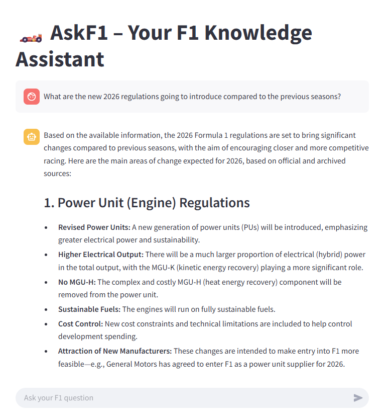

# 🏎️ AskF1 — A Chatbot for Formula 1 Fans



**AskF1** is a conversational AI chatbot built with LangChain, OpenAI, and Astra DB. It answers F1-related questions using up-to-date documents, scraped race schedules, and historical FIA rules. Whether you want to know when the next race is or who won the last Grand Prix, AskF1 is here to help.

---

## 🚀 Features

- 🧠 RAG (Retrieval-Augmented Generation) using LangChain + OpenAI
- 🗂️ Vector search with Astra DB
- 🗓️ Time-aware logic for questions like “When is the next race?”
- 🌐 Web scraping of official F1 pages
- 🗨️ Simple UI via Streamlit

---

## 📦 Setup Instructions

### 1. Clone the Repo

```bash
git clone https://github.com/BuffWuff1712/f1_app.git
cd askf1
```

### 2. Set Up Python Environment

```bash
python -m venv .venv
source .venv/bin/activate   # On Windows: .venv\Scripts\activate
```

### 3. Install Dependencies

```bash
pip install -r requirements.txt
```

---

### 4. 🔐 Request Your API Keys

Before running the app, you'll need the following API keys:

- **OpenAI API Key**
- **Astra DB Token, API Endpoint, and Keyspace**
- **User-Agent Identifier**

👉 Request your keys securely using this Google Form:  
**[📄 Request Access → Google Form](https://your-google-form-link.com)**

---

### 5. Add Secrets

Once you receive the credentials, add them to Streamlit using either of the following:

#### ✅ Option A: `.streamlit/secrets.toml` (for local use)

Create the file `.streamlit/secrets.toml` and paste the following:

```toml
OPENAI_API_KEY = "sk-..."
ASTRA_DB_APPLICATION_TOKEN = "Astra..."
ASTRA_DB_API_ENDPOINT = "https://your-db.apps.astra.datastax.com"
ASTRA_DB_KEYSPACE = "your_keyspace"
USER_AGENT = "AskF1Bot/1.0"
```

#### ✅ Option B: Streamlit Cloud (for deployment)

Go to your app settings → **Secrets** tab → paste the same values there.

---

## ▶️ Run the App

After setup, start the chatbot with:

```bash
streamlit run app.py
```

The app will launch in your browser at:  
`http://localhost:8501`

---

## 📚 How It Works

- `webscrape_update.py`: Collects and uploads latest F1 news, driver info, team lists, and race schedules to Astra DB.
- `rag_pipeline.py`: Combines static FIA rules and live updates into a unified retriever pipeline.
- `app.py`: The Streamlit chatbot interface using LangChain’s `RetrievalQA`.

---

## 📌 Future Improvements

- Search-specific filtering (e.g. restrict by season or document source)
- Voice or Telegram integration
- Enhanced race prediction and analysis features

---

## 🤝 Credits

Built by Bing Heng, an F1 fan , for F1 fans.  
Powered by OpenAI, LangChain, and Datastax Astra DB.